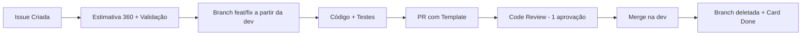

# 🏛️ O Sindicato

> Sistema de gestão de grupos com moeda social (Pikas), dívidas com escrow e votação ponderada.

---

## O que é?

**O Sindicato** é uma aplicação web onde grupos de pessoas podem:

- **Registrar dívidas** entre membros com bloqueio de Pikas em escrow (garantia).
- **Votar em enquetes** com peso proporcional ao saldo de Pikas.
- **Gerenciar reputação** através de uma moeda interna (Pikas) que funciona como poder de voto e penhor de compromisso.

Cada membro recebe **100 Pikas** ao entrar em um grupo. O saldo é **local ao grupo** (multi-tenancy).

---

## Stack Tecnológica

| Camada | Tecnologia |
| --- | --- |
| **Backend** | .NET 10, C#, MediatR, FluentValidation, EF Core |
| **Frontend** | React 19, TypeScript, Zod, React Hook Form |
| **Runtime/Tooling** | Bun (runtime, bundler, package manager) |
| **Banco de Dados** | PostgreSQL 16+ (via Docker) |
| **Autenticação** | JWT (Bearer Token) |
| **Ícones** | Lucide React |
| **Infra Local** | Docker + Docker Compose |
| **Versionamento** | Git + GitHub (Projects para board) |

---

## Arquitetura

### Backend (Layered Architecture)

```
Syndicate.API            → Controllers, Middlewares, Swagger
Syndicate.Domain         → Entities, Features (MediatR), DTOs, Interfaces
Syndicate.Infrastructure → EF Core, Repositories, Integrations
```

### Frontend (Feature-Based)

```
src/
├── components/     → UI genérica (Button, Modal, Badge)
├── config/         → Env, Axios, Rotas
├── features/       → Módulos de negócio (debts/, polls/, auth/)
├── hooks/          → Hooks globais (useAuth, useLocalStorage)
├── pages/          → Views de rota
├── services/       → Instância da API
└── utils/          → Formatadores (currency, date)
```

---

## Quick Start

> Para o guia completo de instalação, veja [docs/SETUP.md](docs/SETUP.md).

### Pré-requisitos

- [.NET 10 SDK](https://dotnet.microsoft.com/download)
- [Bun](https://bun.sh/) (última versão)
- [Docker](https://www.docker.com/get-started/) (para PostgreSQL)
- [Git](https://git-scm.com/)

### Clonar e Rodar

```bash
# 1. Clonar
git clone https://github.com/InoD3v/O-Sindicato.git
cd O-Sindicato

# 2. Backend
cd backend
cp appsettings.Example.json appsettings.Development.json
# Edite appsettings.Development.json com suas credenciais locais
dotnet restore
dotnet ef database update
dotnet run

# 3. Frontend (em outro terminal)
cd frontend
cp .env.example .env
# Edite .env com a URL da API (ex: VITE_API_URL=http://localhost:5000)
bun install
bun run dev
```

---

## Documentação

Toda a documentação do projeto está em [`docs/`](docs/):

| Documento | Descrição |
| --- | --- |
| [GERAL.md](docs/GERAL.md) | Regras de segurança, .gitignore, variáveis de ambiente, lint, boas práticas |
| [WORKFLOW.md](docs/WORKFLOW.md) | Branches, commits semânticos, ciclo de PR, template de PR |
| [BACKEND.md](docs/BACKEND.md) | Arquitetura .NET, nomenclatura, EF Core, DI, MediatR, JWT |
| [FRONTEND.md](docs/FRONTEND.md) | React 19/TS, estrutura de pastas, Zod, Axios, Context API |
| [MVP_REGRAS_NEGOCIOS_v1.0.md](docs/MVP_REGRAS_NEGOCIOS_v1.0.md) | Glossário, regras de negócio (BRs), casos de uso (UCs), diagramas |
| [DEFINITION_OF_DONE.md](docs/DEFINITION_OF_DONE.md) | Critérios de qualidade, testes, code review, responsabilidades |
| [GITHUB_ISSUES_GUIDE.md](docs/GITHUB_ISSUES_GUIDE.md) | Templates de issues, Estimativa 360, labels, validação |
| [SETUP.md](docs/SETUP.md) | Guia completo de configuração do ambiente local |
| [ADR/](docs/ADR/) | Registros de decisões arquiteturais |

---

## Fluxo de Trabalho Resumido



1. Toda tarefa nasce como **Issue** com [template obrigatório](docs/GITHUB_ISSUES_GUIDE.md).
2. Branches seguem o padrão `tipo/[sprint]-[modulo]-[descricao]` a partir da `dev`.
3. Commits usam **Conventional Commits** (`feat:`, `fix:`, `docs:`, etc.).
4. PRs exigem **1 aprovação** de revisor + template preenchido.
5. Código só chega na `main` vindo da `dev`.

---

## Conceitos-Chave do Negócio

| Conceito | Descrição |
| --- | --- |
| **Pikas** | Moeda interna do grupo. Valor inicial: 100 por membro. |
| **Escrow** | Pikas bloqueadas como garantia ao aceitar uma dívida. |
| **Ledger** | Sistema de livro-razão — saldo = soma das transações. |
| **Peso do Voto** | Saldo total de Pikas (incluindo escrow) no momento do voto. |

---

## Contribuindo

1. Leia **toda** a documentação em [`docs/`](docs/) antes de codar.
2. Configure seu ambiente seguindo o [SETUP.md](docs/SETUP.md).
3. Siga as regras de [GERAL.md](docs/GERAL.md) (segurança, lint, .gitignore).
4. Abra Issues conforme o [GITHUB_ISSUES_GUIDE.md](docs/GITHUB_ISSUES_GUIDE.md).
5. Garanta que seu código atende ao [DEFINITION_OF_DONE.md](docs/DEFINITION_OF_DONE.md).

---

## Licença

Este projeto é privado e pertence ao time de mentoria. Uso interno apenas.
