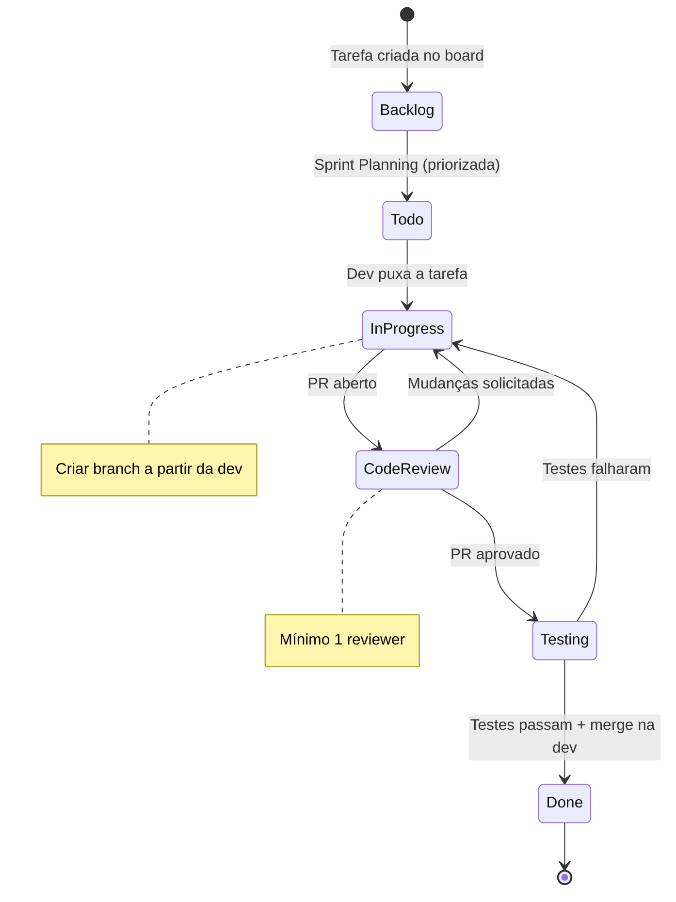
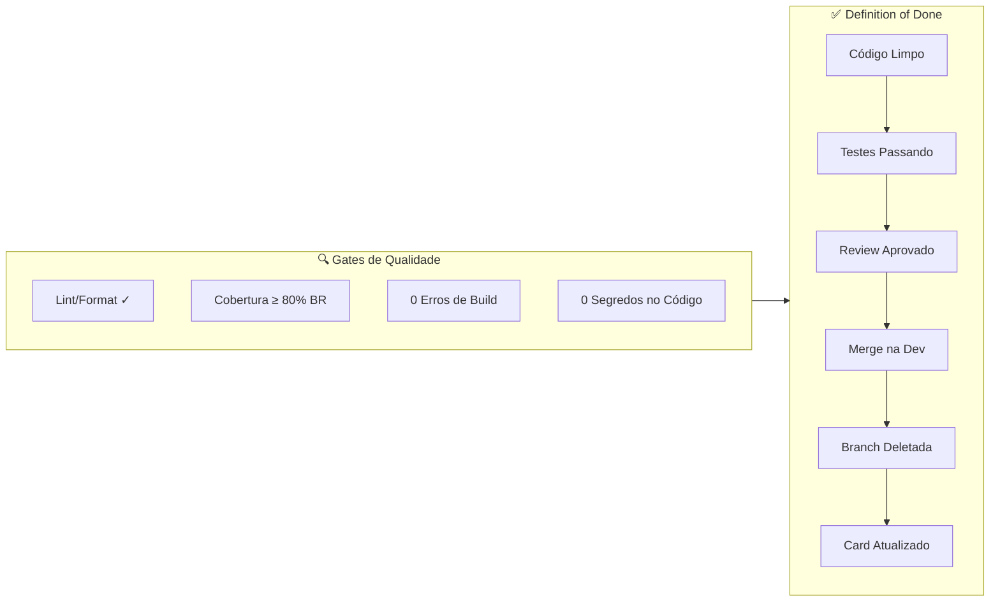

# ✅ Definition of Done (DoD): Projeto "O Sindicato"

Este documento define os **critérios obrigatórios** que toda tarefa (task/issue) deve cumprir para ser considerada **"Pronta"**. Nenhum Pull Request pode ser mergeado sem atender a todos os itens aplicáveis.

---

## 1. Critérios Gerais (Aplicáveis a Toda Tarefa)

Independente de ser frontend, backend ou documentação, toda tarefa deve:

- [ ] Estar vinculada a uma **Issue/Card** no board do projeto (GitHub Projects).
- [ ] Ter sido desenvolvida em uma branch seguindo o padrão de nomenclatura (`tipo/[sprint]-[modulo]-[descricao-curta]`).
- [ ] Ter sido criada a partir da branch `dev` (exceto hotfixes).
- [ ] Possuir **commits semânticos** seguindo o padrão `tipo(escopo) descrição` — ex.: `feat(S1-VOTACAO) implementa cálculo de voto`.
- [ ] Não conter **credenciais, segredos ou dados sensíveis** no código.
- [ ] Não conter arquivos gerados (`node_modules/`, `bin/`, `obj/`, `dist/`, etc.).
- [ ] Ter passado pelo **Code Review** com pelo menos **1 aprovação** de um revisor que **não participou** da implementação.
- [ ] Não possuir conflitos com a branch `dev`.
- [ ] Ter **impedimentos e dependências** mapeados na Issue (ou explicitamente marcado como "Nenhum impedimento identificado").
- [ ] Todas as Issues marcadas como **"Bloqueada por"** já estão **Done** antes de iniciar o trabalho.
- [ ] Ao finalizar, verificar se existem Issues que esta tarefa **desbloqueia** e notificar os responsáveis.

---

## 2. Critérios de Qualidade de Código

### 2.1 Idioma e Nomenclatura

- [ ] Todo o código (variáveis, funções, classes, interfaces) está em **inglês**.
- [ ] Os nomes seguem as convenções definidas em [BACKEND.md](BACKEND.md) e [FRONTEND.md](FRONTEND.md) (`PascalCase`, `camelCase`, `_camelCase`, `snake_case` no banco).
- [ ] Não existem nomes genéricos como `data`, `info`, `coisa`, `temp` sem contexto claro.

### 2.2 Separação de Responsabilidades

#### Backend (.NET)

| Camada | Responsabilidade | Proibido |
| --- | --- | --- |
| **Controller** | Receber request e delegar ao MediatR | Lógica de negócio, acesso direto ao banco |
| **Handler** | Orquestrar a lógica de negócio | Retornar entidades de banco diretamente |
| **Validator** | Validar dados de entrada (FluentValidation) | Lógica de negócio complexa |
| **Repository/Infra** | Acesso a dados (EF Core) | Regras de negócio |
| **Entity** | Representar dados do domínio | Dependências de infraestrutura |

- [ ] Controllers estão **magras** (Thin Controllers) — apenas delegam ao `IMediator`.
- [ ] Entidades seguem **Rich Domain Model** — mutações via métodos com guards, setters são `private set`.
- [ ] Entidades de banco **nunca** são retornadas diretamente na API — sempre usar DTOs/Responses.
- [ ] Métodos de IO são `async` + sufixo `Async`.
- [ ] Serviços são injetados via **construtor** (nunca `serviceProvider.GetService`).

#### Frontend (React + TS)

| Camada | Responsabilidade | Proibido |
| --- | --- | --- |
| **Service** | Chamadas HTTP (axios). Separar Queries de Commands (CQRS). | Lógica de estado, manipulação de UI |
| **Hook** ("🧠 Cérebro") | Lógica de estado, efeitos, validações. Chama o Service. | JSX, chamadas HTTP diretas |
| **Component** ("🧱 Burro") | Recebe props, renderiza UI. Zero lógica. Atomic Design: Atom → Molecule → Organism. | `useState`, `useEffect`, chamadas a API |
| **View / Page** ("🎼 Maestro") | Orquestra Components + injeta Hooks | Lógica de negócio, styled components inline |

- [ ] Nenhum componente `.tsx` ultrapassa **150 linhas**.
- [ ] Chamadas à API estão **isoladas nos Services** (nunca no Hook direto).
- [ ] Estado e lógica de negócio estão nos **Hooks**.
- [ ] Componentes são **burros** — recebem props, não buscam dados.
- [ ] Componentes globais (`src/components/`) estão classificados em **atoms/**, **molecules/** ou **organisms/** (Atomic Design).
- [ ] Páginas vivem em `features/<feature>/pages/` e são re-exportadas pelo barrel `src/pages/index.ts`.
- [ ] Services separam funções de **Queries** (leitura) e **Commands** (escrita) — CQRS.
- [ ] Styled Components estão em arquivos **`.styles.ts` separados** (nunca dentro do `.tsx`).
- [ ] Não existe uso de `any` no TypeScript.
- [ ] Formulários possuem **schema Zod** para validação.

---

## 3. Critérios de Testes

### 3.1 Cobertura Mínima Obrigatória

| Tipo de Código | Cobertura Mínima | Obrigatório? |
| --- | --- | --- |
| **Regras de Negócio / Handlers** | **80%** | ✅ Sim |
| **Validators (FluentValidation / Zod)** | **80%** | ✅ Sim |
| **Services / Repositories** | **60%** | ✅ Sim |
| **Controllers / Views** | **—** | ❌ Não (cobertos por integração) |
| **Utils / Helpers** | **90%** | ✅ Sim |

### 3.2 Requisitos de Testes

- [ ] Toda regra de negócio nova possui **ao menos 1 teste de caminho feliz** (happy path) e **1 teste de erro** (sad path).
- [ ] Testes de **Escrow/Pikas** devem cobrir obrigatoriamente:
  - Aceite com saldo suficiente.
  - Aceite com saldo insuficiente (`ERR_INSUFFICIENT_PIKAS`).
  - Tentativa de auto-dívida (`ERR_SELF_DEBT`).
- [ ] Testes de **Votação** devem validar o cálculo de peso por Pikas.
- [ ] Testes unitários **não dependem** de banco de dados real (usar mocks/in-memory).
- [ ] Testes rodam com sucesso localmente **antes** de abrir o PR.

### 3.3 Nomenclatura de Testes

Seguir o padrão: `MethodName_Scenario_ExpectedResult`

```csharp
// Backend (.NET)
[Fact]
public async Task AcceptDebt_WhenInsufficientBalance_ShouldReturnError()

[Fact]
public async Task AcceptDebt_WhenValidBalance_ShouldBlockPikas()
```

```typescript
// Frontend (React/TS)
describe("useDebtActions", () => {
  it("should block accept button when balance is insufficient", () => { ... })
  it("should show success toast after debt acceptance", () => { ... })
})
```

---

## 4. Critérios de Code Review

### 4.1 Regras do Revisor

- Todo PR precisa de **no mínimo 1 aprovação** de alguém que **NÃO** trabalhou na tarefa.
- **Auto-merge é proibido** — ninguém aprova seu próprio código.
- O revisor deve verificar **todos os itens** do checklist abaixo antes de aprovar.
- Comentários de review devem ser **construtivos e objetivos** — foque no código, não na pessoa.
- Se houver dúvida sobre uma decisão arquitetural, **peça esclarecimento** antes de reprovar.

### 4.2 Checklist do Revisor

#### Geral

- [ ] O PR possui **descrição** seguindo o template definido em [WORKFLOW.md](WORKFLOW.md)?
- [ ] A branch segue o padrão de nomenclatura?
- [ ] Os commits são semânticos?
- [ ] Não há `console.log`, `TODO`, `HACK` ou comentários de debug esquecidos?
- [ ] Não há credenciais ou dados sensíveis?

#### Backend

- [ ] Existe lógica de negócio dentro da Controller?
- [ ] A entidade do banco está sendo retornada no JSON da API?
- [ ] Existe mutação direta de propriedade de entidade fora da própria entidade? (Deve ser um método na entidade — Rich Domain Model).
- [ ] O código é assíncrono do início ao fim (`async/await`)?
- [ ] Existe tratamento manual de saldo ou está seguindo a estratégia definida pelo time (ver [ADR 004](ADR/004-ledger-ao-inves-de-coluna-balance.md))?
- [ ] O `Down()` da Migration reverte corretamente o `Up()`?

#### Frontend

- [ ] Existe `useState`, `useEffect` ou lógica dentro de um `.tsx` de View ou Component? (Deve estar num Hook).
- [ ] Existem styled components definidos dentro de um `.tsx`? (Devem estar em `.styles.ts`).
- [ ] O componente é burro (recebe props) ou busca dados sozinho?
- [ ] Componentes globais estão na pasta atômica correta (atoms/molecules/organisms)?
- [ ] Páginas estão em `features/<feature>/pages/` e re-exportadas no barrel `src/pages/index.ts`?
- [ ] Services separam Queries de Commands (CQRS)?
- [ ] Os valores monetários (Pikas) estão formatados via `utils`?
- [ ] Os formulários possuem validação visual de erro?
- [ ] O componente é responsivo?
- [ ] Existe uso de `any`?
- [ ] O código passa `bun run lint` sem erros?

---

## 5. Ciclo de Vida da Tarefa



### Detalhamento das Etapas

| Etapa | Responsável | O que acontece | Critério de saída |
| --- | --- | --- | --- |
| **Backlog** | Product Owner / Mentor | Tarefa descrita com contexto de negócio | Descrição clara + critérios de aceite |
| **Todo** | Time | Tarefa priorizada para a sprint atual | — |
| **In Progress** | Desenvolvedor | Codificação + testes locais | Código pronto + testes passando localmente |
| **Code Review** | Revisor(es) | Análise do PR conforme checklist | 1 aprovação sem pedidos de changes pendentes |
| **Testing** | Automatizado / QA | Testes CI rodam na pipeline | Todos os testes passam, sem erros de lint |
| **Done** | Desenvolvedor | Merge na `dev` + branch deletada | Branch removida, card atualizado |

---

## 6. Regras de Responsabilidade

### 6.1 Quem Faz o Quê

| Papel | Responsabilidades Primárias |
| --- | --- |
| **Desenvolvedor** | Implementar seguindo os padrões, escrever testes, abrir PR com template preenchido |
| **Revisor** | Analisar código pelo checklist, dar feedback construtivo, aprovar ou solicitar mudanças |
| **Mentor/Lead** | Definir prioridades, resolver bloqueios técnicos, manter documentação atualizada |

### 6.2 Regras de Ownership

- Cada tarefa tem **1 responsável principal** (assignee). Se for pair programming, ambos devem estar indicados.
- O **autor do PR** é responsável por resolver os comentários do review e pedir re-review quando pronto.
- O **revisor** que aprovou é co-responsável pela qualidade — não aprove sem ler o código.
- Quem fez o **merge** é responsável por deletar a branch e atualizar o card no board.

---

## 7. Classificação de Tarefas por Tamanho

Para facilitar o planejamento de sprint, usamos a seguinte escala:

| Tamanho | Story Points | Descrição | Exemplo |
| --- | --- | --- | --- |
| **P (Pequeno)** | 1-2 | Alteração simples, pouca lógica | Fix de typo, ajuste de estilo, adicionar campo em DTO |
| **M (Médio)** | 3-5 | Feature com lógica moderada | CRUD simples, novo componente com hook |
| **G (Grande)** | 8-13 | Feature complexa, múltiplas camadas | Fluxo de Escrow completo, sistema de votação |

> **Regra:** Se uma tarefa for estimada como **G (Grande)**, ela **deve ser quebrada** em subtarefas menores antes de iniciar o desenvolvimento.

---

## 8. Critérios de Aceite (Exemplo Prático)

Para ilustrar como aplicar este documento, segue um exemplo de uma tarefa real:

### Tarefa: "Implementar Aceite de Dívida" (`feat/S1-DIVIDAS-aceite-escrow`)

**Critérios de Aceite:**

1. ✅ Devedor pode aceitar dívida com saldo suficiente → Status muda para `ACTIVE_ESCROW`.
2. ✅ Sistema bloqueia Pikas no aceite → `Saldo Disponível` diminui corretamente.
3. ✅ Devedor sem saldo recebe erro claro (`ERR_INSUFFICIENT_PIKAS`).
4. ✅ Teste unitário do Handler cobre caminho feliz e caminho de erro.
5. ✅ Teste valida que o saldo em Escrow **não é deduzido** do peso de voto.
6. ✅ Frontend mostra feedback visual (toast de sucesso ou mensagem de erro).
7. ✅ PR aprovado por pelo menos 1 revisor.
8. ✅ Nenhum `console.log` ou dado sensível no código.

---

## Resumo Visual



---

> **Lembrete:** Este documento é **vivo**. Conforme o time evolui, as regras podem ser ajustadas. Qualquer mudança deve ser discutida e aprovada pelo time antes de ser aplicada.
