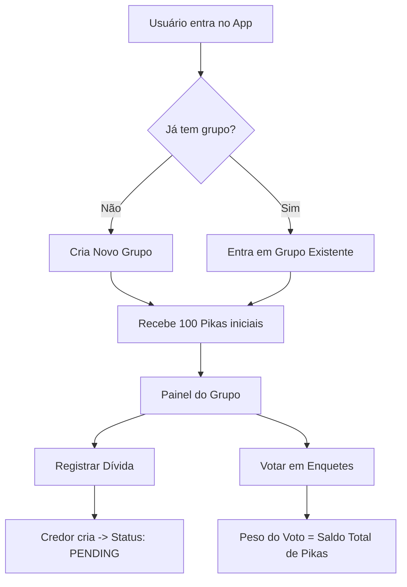
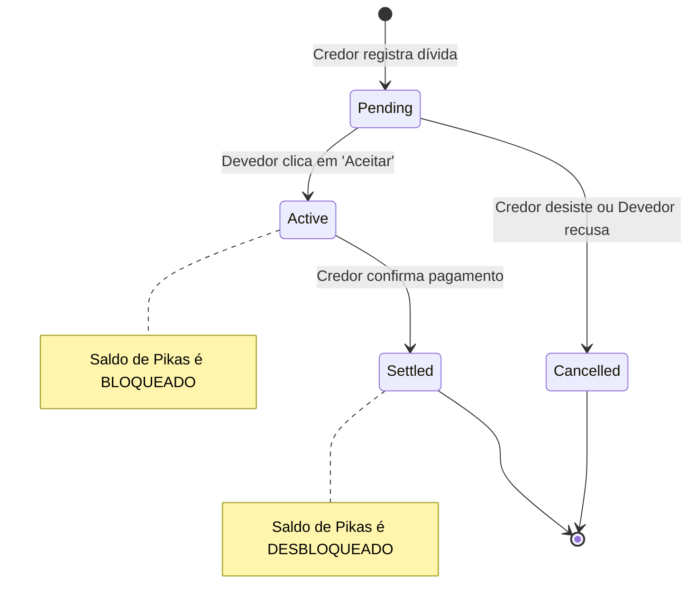
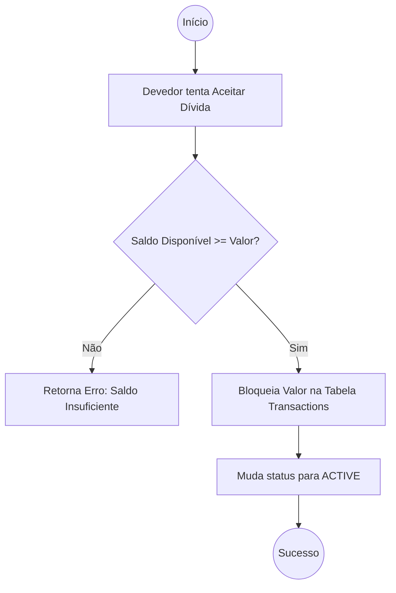

# 🛡️ Regras Gerais do Repositório: Projeto "O Sindicato"

Este guia estabelece as normas de higiene e segurança que todos os membros devem seguir. O descumprimento destas regras pode comprometer a segurança da aplicação ou dificultar o trabalho dos colegas.

---

## 1. Segurança e Credenciais (Zero Trust)

A regra mais importante: **Nunca, sob nenhuma circunstância, suba credenciais ou segredos para o Git.**

* **Arquivos Sensíveis:** Arquivos como `.env`, `appsettings.json` (com senhas), `.pfx`, ou `google-services.json` devem estar no `.gitignore`.
* **Exemplos como Guia:** Para cada arquivo de configuração sensível, devemos manter um arquivo de exemplo (Ex: `.env.example` ou `appsettings.Example.json`) com valores fictícios.
* **Vazamento de Dados:** Se você acidentalmente subir uma senha, avise o mentor imediatamente. A senha deve ser revogada (trocada) e o histórico do Git limpo.

---

## 2. Higiene do Repositório (.gitignore)

Não "suje" o repositório com arquivos que são gerados automaticamente pela sua máquina ou IDE.

### Frontend (React/Node)

* **Proibido subir:** `node_modules/`, `dist/`, `build/`, `.eslintcache`.
* **Por que?** Esses arquivos são recriados ao rodar `npm install` ou `npm run build`.

### Backend (.NET)

* **Proibido subir:** `bin/`, `obj/`, `.vs/`, `.user`, `*.db` (bancos locais).
* **Por que?** São artefatos de compilação que variam de máquina para máquina.

---

## 3. Variáveis de Ambiente (.env)

Usaremos variáveis de ambiente para tudo que muda conforme o local onde o código roda.

* **Local:** Cada desenvolvedor terá seu próprio `.env` ou `appsettings.Development.json`.
* **Padrão de Nomenclatura:** Use nomes claros em inglês (Ex: `DATABASE_URL`, `JWT_SECRET`, `VITE_API_URL`).
* **Acesso no Código:** Nunca use valores "hardcoded" (fixos) no código. Sempre busque da variável de ambiente.

---

## 4. Padronização de Estilo (Lint & Formatter)

Para evitar brigas de estilo no Code Review e garantir que o código pareça escrito por uma única pessoa:

* **EditorConfig:** Teremos um arquivo `.editorconfig` na raiz. Ele configura automaticamente o seu VS Code ou Visual Studio para usar o mesmo número de espaços, tipo de quebra de linha e indentação.
* **Prettier/ESLint (Front):** O build falhará se houver erros de lint. Formate seu código antes de commitar.
* **Format on Save:** Recomendamos ativar a opção "Format on Save" na sua IDE.

---

## 5. Boas Práticas de "Chão de Fábrica"

* **DRY (Don't Repeat Yourself):** Se você está copiando e colando a mesma lógica em três lugares, ela deveria ser uma função ou componente genérico.
* **KISS (Keep It Simple, Stupid):** Não complique a arquitetura agora. O foco é o MVP funcional.
* **YAGNI (You Ain't Gonna Need It):** Não crie funcionalidades "pro futuro" que não estão no escopo do MVP.
* **Boy Scout Rule:** Se você passar por um código bagunçado e puder limpá-lo sem quebrar nada, faça-o. Deixe o código sempre um pouco melhor do que encontrou.

---

## 6. Comunicação no Repositório

* **Issues/Tasks:** Use as tarefas do board (GitHub Projects/Trello) como fonte da verdade. Não invente tarefas que não estão lá sem avisar o líder.
* **Comentários no Código:** Comente o **PORQUÊ** de uma lógica complexa, não o **COMO**. O código deve ser claro o suficiente para explicar o "como".
* *Ruim:* `// Incrementa o saldo`
* *Bom:* `// Bloqueamos o saldo aqui para garantir o escrow antes do aceite da dívida`

---

## Diagramas

### 1. Fluxo Geral do Sistema (User Journey)

Este diagrama mostra desde a entrada do usuário até o uso das Pikas.

---

### 2. O Ciclo de Vida do Escrow (A "Dívida")

Este é o ponto mais crítico para os desenvolvedores de Backend e Frontend entenderem.

---

### 3. Lógica de Validação de Saldo (Backend)

Como o código deve se comportar quando alguém tenta aceitar um acordo.

