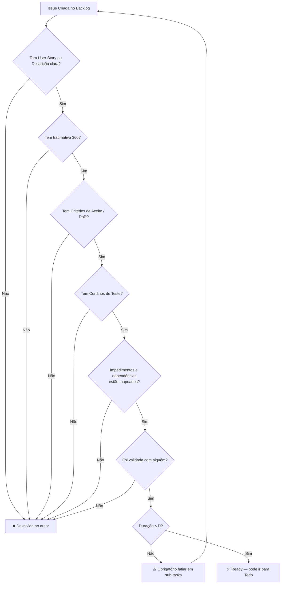
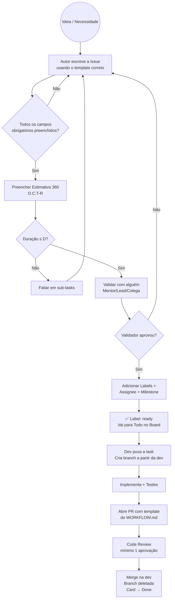

# 📋 Guia de Criação de Issues no GitHub: Projeto "O Sindicato"

Este documento define o **processo obrigatório** para abertura de Estórias, Tasks, Bugs e Spikes no GitHub. Nenhum trabalho deve ser iniciado sem uma Issue bem estruturada e validada.

> **Filosofia:** Uma Issue mal escrita gera código mal feito. Se você não consegue explicar o que precisa ser feito em uma Issue, você ainda não entendeu o problema.

---

## 1. Tipos de Issue

| Tipo | Label | Quando usar | Exemplo |
| --- | --- | --- | --- |
| **User Story** | `story` | Funcionalidade com valor para o usuário final | "Como devedor, quero aceitar uma dívida para honrar meu compromisso" |
| **Task** | `task` | Trabalho técnico que não é visível ao usuário | Configurar CI/CD, criar migration, refatorar service |
| **Bug** | `bug` | Comportamento incorreto em código já existente | "Saldo não é bloqueado ao aceitar dívida" |
| **Spike** | `spike` | Pesquisa/estudo técnico antes de implementar | Avaliar lib de WebSocket para notificações em tempo real |

---

## 2. Anatomia de uma User Story

Toda User Story **deve** seguir o formato abaixo. Campos marcados com ⚠️ são **obrigatórios** — a Issue será devolvida se estiverem vazios.

### Template Completo

```markdown
## 📖 User Story ⚠️
**Como** [tipo de usuário],
**Quero** [ação/funcionalidade],
**Para que** [benefício/valor de negócio].

## 🎯 Critérios de Aceite ⚠️
- [ ] Critério 1 (comportamento esperado claro e testável)
- [ ] Critério 2
- [ ] Critério 3

## 📊 Estimativa 360 (D.C.T-R) ⚠️
`[Duração].[Complexidade].[Tamanho]-[Risco]`

| Dimensão | Valor | Justificativa |
| --- | --- | --- |
| **Duração** | Ex: 2D | Dois dias úteis para implementar back + front |
| **Complexidade** | Ex: 5 | Lógica de Escrow exige atenção, mas o caminho é conhecido |
| **Tamanho** | Ex: M | Handler + Validator + Hook + Componente |
| **Risco** | Ex: A | Alteração em lógica de saldo (área crítica) |

## ✅ Definition of Done ⚠️
- [ ] Testes unitários escritos (happy path + sad path)
- [ ] Cobertura de testes atende o mínimo por camada (ver DoD)
- [ ] Code Review aprovado (mínimo 1 reviewer)
- [ ] Sem `console.log`, `TODO`, credenciais ou comentários de debug
- [ ] Branch deletada após merge
- [ ] Card atualizado no board

## 🧪 Cenários de Teste ⚠️
### Caminho Feliz (Happy Path)
1. Dado que [pré-condição]
2. Quando [ação]
3. Então [resultado esperado]

### Caminho de Erro (Sad Path)
1. Dado que [pré-condição]
2. Quando [ação inválida]
3. Então [erro esperado com código/mensagem]

## ⛓️ Impedimentos e Dependências ⚠️
- [ ] **Bloqueada por:** #XX — (descrever o que impede: Ex: "Precisa da migration da tabela debts")
- [ ] **Bloqueia:** #YY — (quais tasks dependem desta para começar)
- [ ] **Dependência externa:** (API de terceiros, decisão pendente, acesso, etc.)

> Se não houver impedimentos, escreva: "Nenhum impedimento identificado."

## 🔗 Referências
- Regra de Negócio: BR0X (ver MVP_REGRAS_NEGOCIOS_v1.0.md)
- Caso de Uso: UC0X
- Documentos relacionados: [BACKEND.md](BACKEND.md), [FRONTEND.md](FRONTEND.md)

## 👥 Validação ⚠️
- [ ] Validado com: @nome-do-mentor-ou-colega
- [ ] Data da validação: DD/MM/AAAA

## 📎 Contexto Adicional
Screenshots, diagramas, links para Figma, dúvidas técnicas, etc.
```

---

## 3. Anatomia de uma Task

Tasks são trabalhos técnicos. Não precisam de User Story no formato "Como/Quero/Para que", mas **precisam de todo o resto**.

### Template

```markdown
## 🔧 Descrição da Task ⚠️
O que precisa ser feito e por quê. Contexto técnico claro.

## 📊 Estimativa 360 (D.C.T-R) ⚠️
`[Duração].[Complexidade].[Tamanho]-[Risco]`

| Dimensão | Valor | Justificativa |
| --- | --- | --- |
| **Duração** | | |
| **Complexidade** | | |
| **Tamanho** | | |
| **Risco** | | |

## ✅ Definition of Done ⚠️
- [ ] (critérios aplicáveis da DoD)

## ⛓️ Impedimentos e Dependências ⚠️
- [ ] **Bloqueada por:** #XX — (descrever o que impede)
- [ ] **Bloqueia:** #YY — (quais tasks dependem desta)
- [ ] **Dependência externa:** (se houver)

> Se não houver impedimentos, escreva: "Nenhum impedimento identificado."

## 🧪 Cenários de Teste (se aplicável)
- [ ] Descrever o que precisa ser validado

## 👥 Validação ⚠️
- [ ] Validado com: @nome
- [ ] Data: DD/MM/AAAA

## 📎 Contexto Adicional
Links, referências, dependências de outras tasks.
```

---

## 4. Anatomia de um Bug

### Template

```markdown
## 🐛 Descrição do Bug ⚠️
O que está acontecendo de errado.

## 🔄 Passos para Reproduzir ⚠️
1. Vá para [tela/endpoint]
2. Faça [ação]
3. Observe [comportamento incorreto]

## ✅ Comportamento Esperado ⚠️
O que deveria acontecer.

## ❌ Comportamento Atual ⚠️
O que está acontecendo de fato.

## 📊 Estimativa 360 (D.C.T-R) ⚠️
`[Duração].[Complexidade].[Tamanho]-[Risco]`

## ⛓️ Impedimentos e Dependências ⚠️
- [ ] **Bloqueada por:** #XX — (descrever o que impede)
- [ ] **Bloqueia:** #YY — (quais tasks dependem desta correção)
- [ ] **Dependência externa:** (se houver)

> Se não houver impedimentos, escreva: "Nenhum impedimento identificado."

## 🧪 Teste de Regressão ⚠️
- [ ] Descrever o teste que deve ser criado para garantir que este bug não volte.

## 👥 Validação ⚠️
- [ ] Validado com: @nome
- [ ] Data: DD/MM/AAAA

## 📎 Evidências
Screenshots, logs de erro, stack traces, prints do console.
```

---

## 5. Anatomia de um Spike

Spikes são **obrigatórios** para qualquer tarefa com Complexidade **8+** na Estimativa 360 (ver [Estimativa 360 — Regra do Spike](../Estimativa_360.md)).

### Template

```markdown
## 🔬 Objetivo do Spike ⚠️
Qual pergunta técnica precisa ser respondida?

## ⏱️ Timebox ⚠️
Tempo máximo reservado para pesquisa: [Ex: 1T (4h), 1D (8h)]

## 📊 Estimativa 360 (D.C.T-R) ⚠️
`[Duração].[Complexidade].[Tamanho]-[Risco]`

## ⛓️ Impedimentos e Dependências ⚠️
- [ ] **Bloqueada por:** #XX — (descrever o que impede)
- [ ] **Bloqueia:** #YY — (quais tasks aguardam o resultado deste Spike)
- [ ] **Dependência externa:** (se houver)

> Se não houver impedimentos, escreva: "Nenhum impedimento identificado."

## 📝 Entregável Esperado ⚠️
- [ ] Documento/comentário na Issue com conclusões
- [ ] Recomendação técnica (qual caminho seguir)
- [ ] Riscos identificados
- [ ] Estimativa revisada para a tarefa original

## 👥 Validação ⚠️
- [ ] Resultado apresentado para: @nome
- [ ] Data: DD/MM/AAAA
```

---

## 6. Regras Obrigatórias para Toda Issue

### 6.1 Campos do GitHub que Devem Ser Preenchidos

| Campo | Obrigatório | Descrição |
| --- | --- | --- |
| **Title** | ✅ | Formato: `[SPRINT]-[MÓDULO]: Descrição curta` (Ex: `S1-DIVIDAS: Implementar aceite de dívida`) |
| **Labels** | ✅ | Tipo (`story`, `task`, `bug`, `spike`) + módulo (`dividas`, `votacao`, `auth`, `ui`) |
| **Assignee** | ✅ | Quem vai executar (pode ser atribuído no planning) |
| **Milestone** | ✅ | Sprint correspondente (Ex: `Sprint 1 - MVP Core`) |
| **Project** | ✅ | Board do GitHub Projects |
| **Estimativa 360** | ✅ | No corpo da Issue, obrigatoriamente preenchida |

### 6.2 Regras de Validação (Gate de Entrada)

Nenhuma Issue entra em **"Todo"** no board sem passar por esta validação:



### 6.3 A Regra da Validação com Alguém

> **Nenhuma Issue é válida sem ter sido revisada por pelo menos 1 pessoa que não seja o autor.**

O objetivo é evitar:
- Estórias ambíguas que cada dev interpreta de um jeito.
- Estimativas irreais (otimistas demais ou pessimistas demais).
- Critérios de aceite incompletos que geram retrabalho.

**Como validar:**

| Método | Quando usar |
| --- | --- |
| **Review na Issue** | Validador comenta "✅ LGTM" na Issue do GitHub |
| **Call rápida** | Para Issues complexas, 10min de call com compartilhamento de tela |
| **Pair Writing** | Escrever a Issue junto com o validador (ideal para Spikes) |

**Quem pode validar:**

| Tipo de Issue | Validador Mínimo |
| --- | --- |
| **Story** | Mentor/Lead **ou** outro dev do time |
| **Task** | Outro dev do time |
| **Bug** | Quem reportou + dev que vai corrigir (alinhamento) |
| **Spike** | Mentor/Lead (obrigatório) |

---

## 7. Checklist Rápido: "Minha Issue Está Pronta?"

Antes de mover a Issue para **Todo**, passe por este checklist:

### Para User Stories

- [ ] Tem "Como/Quero/Para que" claro?
- [ ] Tem **ao menos 3 critérios de aceite** específicos e testáveis?
- [ ] Tem **Estimativa 360** preenchida com justificativa em cada dimensão?
- [ ] A Duração é **≤ D (1 dia)**? Se não, está fatiada em sub-tasks?
- [ ] Tem **cenários de teste** (happy path + sad path)?
- [ ] Referencia a **Regra de Negócio** correspondente (BR0X)?
- [ ] Tem **DoD** checklist incluído?
- [ ] Tem **impedimentos e dependências** mapeados (ou marcado "Nenhum")?
- [ ] Foi **validada** por alguém (nome + data registrados)?
- [ ] Tem **Labels** corretas (tipo + módulo)?
- [ ] Tem **Assignee** e **Milestone** definidos?

### Para Tasks

- [ ] Tem descrição técnica clara do que fazer e por quê?
- [ ] Tem **Estimativa 360**?
- [ ] Duração **≤ D**?
- [ ] Tem **DoD** aplicável?
- [ ] Tem **impedimentos e dependências** mapeados?
- [ ] Foi **validada**?
- [ ] Tem **Labels**, **Assignee** e **Milestone**?

### Para Bugs

- [ ] Tem passos para reproduzir?
- [ ] Descreve comportamento esperado **vs** atual?
- [ ] Tem evidências (screenshot, log, stack trace)?
- [ ] Tem **teste de regressão** planejado?
- [ ] Tem **Estimativa 360**?
- [ ] Tem **impedimentos e dependências** mapeados?
- [ ] Foi **validada** (alinhamento entre quem reportou e quem vai corrigir)?

### Para Spikes

- [ ] Tem pergunta clara a ser respondida?
- [ ] Tem **timebox** definido?
- [ ] Entregável esperado está descrito?
- [ ] Tem **impedimentos e dependências** mapeados?
- [ ] Foi **validada com o Mentor/Lead**?

---

## 8. Exemplo Completo: Issue Real do Projeto

### `S1-DIVIDAS: Implementar aceite de dívida com Escrow`

```markdown
## 📖 User Story
**Como** devedor,
**Quero** aceitar uma dívida registrada contra mim,
**Para que** minhas Pikas fiquem bloqueadas em garantia e o credor tenha confiança
no meu compromisso.

## 🎯 Critérios de Aceite
- [ ] Devedor com saldo suficiente consegue aceitar → Status muda para `ACTIVE_ESCROW`
- [ ] Sistema bloqueia as Pikas do devedor (saldo disponível diminui)
- [ ] Devedor sem saldo recebe erro `ERR_INSUFFICIENT_PIKAS` com mensagem amigável
- [ ] Tentativa de aceitar própria dívida retorna `ERR_SELF_DEBT`
- [ ] Pikas em Escrow continuam contando para peso de voto (BR05)
- [ ] Frontend mostra toast de sucesso ou mensagem de erro

## 📊 Estimativa 360 (D.C.T-R)
`1D.6.M-A`

| Dimensão | Valor | Justificativa |
| --- | --- | --- |
| **Duração** | 1D | Backend (Handler + Validator) + Frontend (Hook + UI) |
| **Complexidade** | 6 | Lógica de Escrow é nova, exige atenção com transações |
| **Tamanho** | M | ~6 arquivos: Command, Handler, Validator, Hook, Component, Tests |
| **Risco** | A (Alerta) | Alteração no core de saldo — requer testes rigorosos |

## ✅ Definition of Done
- [ ] Testes unitários do Handler (happy + sad path)
- [ ] Testes do Validator (saldo insuficiente, auto-dívida)
- [ ] Cobertura ≥ 80% no Handler e Validator
- [ ] Code Review aprovado (mínimo 1 reviewer)
- [ ] Sem console.log, TODO ou credenciais
- [ ] Branch deletada após merge
- [ ] Card atualizado no board

## 🧪 Cenários de Teste

### Happy Path
1. Dado que o devedor tem 100 Pikas de saldo disponível
2. Quando aceita uma dívida de 50 Pikas
3. Então o status muda para `ACTIVE_ESCROW` e o saldo disponível cai para 50

### Sad Path — Saldo Insuficiente
1. Dado que o devedor tem 30 Pikas de saldo disponível
2. Quando tenta aceitar uma dívida de 50 Pikas
3. Então recebe erro `ERR_INSUFFICIENT_PIKAS`

### Sad Path — Auto-dívida
1. Dado que o usuário é credor e devedor ao mesmo tempo
2. Quando tenta aceitar a própria dívida
3. Então recebe erro `ERR_SELF_DEBT`

## ⛓️ Impedimentos e Dependências
- [ ] **Bloqueada por:** #12 — Precisa da migration da tabela `debts` estar mergeada
- [ ] **Bloqueia:** #15 — Resolução de dívida depende do Escrow funcional
- [ ] **Dependência externa:** Nenhuma

## 🔗 Referências
- Regras: BR03 (Validação de Escrow), BR05 (Peso do Voto)
- Caso de Uso: UC02 (Aceite e Bloqueio)
- Docs: BACKEND.md (MediatR Pattern), DEFINITION_OF_DONE.md

## 👥 Validação
- [ ] Validado com: @InoD3v
- [ ] Data da validação: 20/02/2026
```

---

## 9. Labels Padrão do Projeto

Configurar as seguintes labels no repositório GitHub:

### Por Tipo

| Label | Cor (hex) | Descrição |
| --- | --- | --- |
| `story` | `#0E8A16` | User Story com valor de negócio |
| `task` | `#1D76DB` | Trabalho técnico interno |
| `bug` | `#D73A4A` | Comportamento incorreto |
| `spike` | `#FBCA04` | Pesquisa/estudo técnico |

### Por Módulo

| Label | Cor (hex) | Descrição |
| --- | --- | --- |
| `dividas` | `#B60205` | Módulo de Dívidas/Escrow |
| `votacao` | `#5319E7` | Módulo de Votação/Enquetes |
| `auth` | `#0075CA` | Autenticação e autorização |
| `ui` | `#E4E669` | Interface geral e componentes |
| `infra` | `#D4C5F9` | CI/CD, configs, devops |
| `docs` | `#C2E0C6` | Documentação |

### Por Prioridade

| Label | Cor (hex) | Descrição |
| --- | --- | --- |
| `priority: critical` | `#B60205` | Bloqueia outros trabalhos |
| `priority: high` | `#D93F0B` | Importante para a sprint |
| `priority: medium` | `#FBCA04` | Importante mas não urgente |
| `priority: low` | `#0E8A16` | Nice to have |

### Por Status

| Label | Cor (hex) | Descrição |
| --- | --- | --- |
| `needs-validation` | `#F9D0C4` | Issue ainda não validada por alguém |
| `ready` | `#0E8A16` | Validada e pronta para ser puxada |
| `blocked` | `#B60205` | Dependência externa ou técnica |

---

## 10. Relacionamento entre Issues

### Sub-tasks

Quando uma Story for grande (Estimativa 360 com Duração **≥ S**), ela deve ser fatiada. Use o seguinte padrão:

```markdown
## 📖 Story Principal (Epic-like)
S1-DIVIDAS: Fluxo completo de dívidas

### Sub-tasks:
- [ ] #12 — S1-DIVIDAS: Criar migration da tabela debts
- [ ] #13 — S1-DIVIDAS: Implementar registro de dívida (UC01)
- [ ] #14 — S1-DIVIDAS: Implementar aceite com Escrow (UC02)
- [ ] #15 — S1-DIVIDAS: Implementar resolução de dívida (UC03)
- [ ] #16 — S1-DIVIDAS: Tela de listagem de dívidas (Frontend)
```

### Dependências

Se uma Issue depende de outra, registre explicitamente:

```markdown
## ⛓️ Dependências
- Blocked by #12 (precisa da migration antes de implementar o Handler)
```

---

## Resumo Visual: O Caminho de uma Issue



---

> **Este documento é complementar a:**
> - [DEFINITION_OF_DONE.md](DEFINITION_OF_DONE.md) — Critérios de qualidade por tarefa
> - [WORKFLOW.md](WORKFLOW.md) — Fluxo de Git, branches e PRs
> - [MVP_REGRAS_NEGOCIOS_v1.0.md](MVP_REGRAS_NEGOCIOS_v1.0.md) — Regras de negócio referenciadas nas Issues
> - [BACKEND.md](BACKEND.md) / [FRONTEND.md](FRONTEND.md) — Padrões técnicos de código
