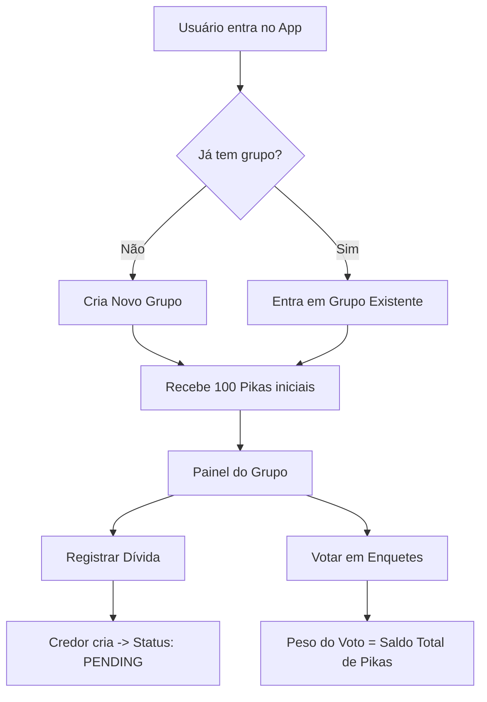
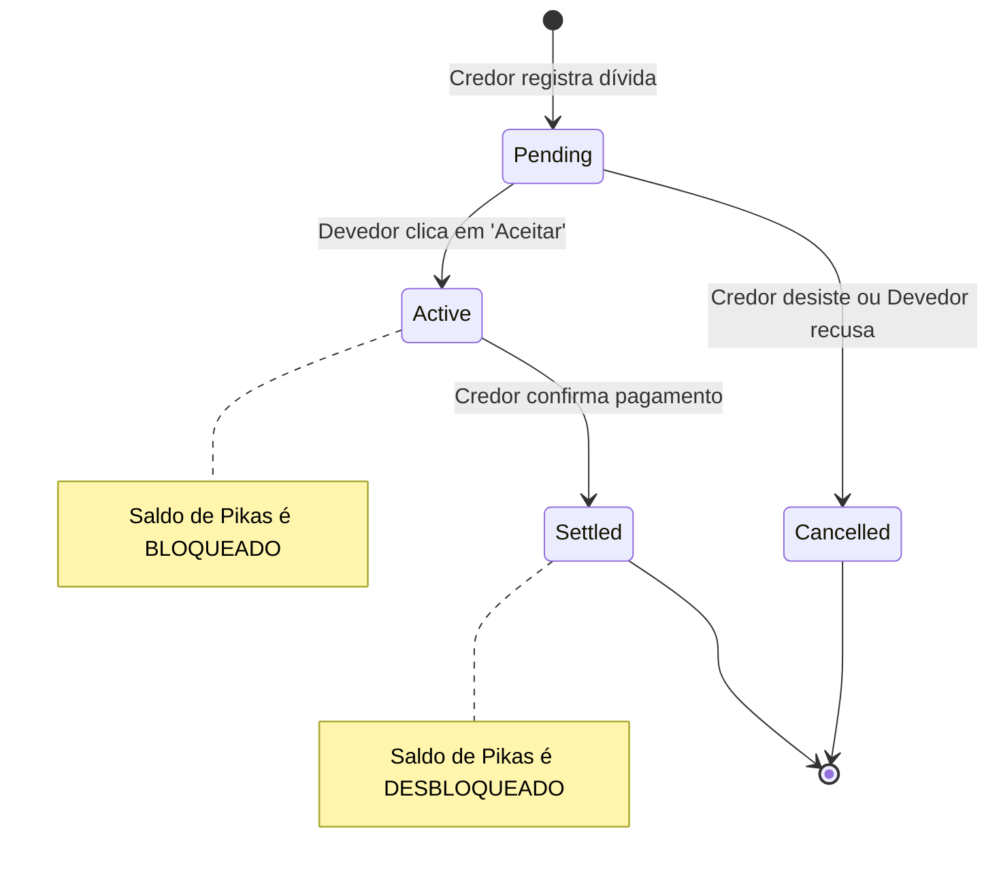
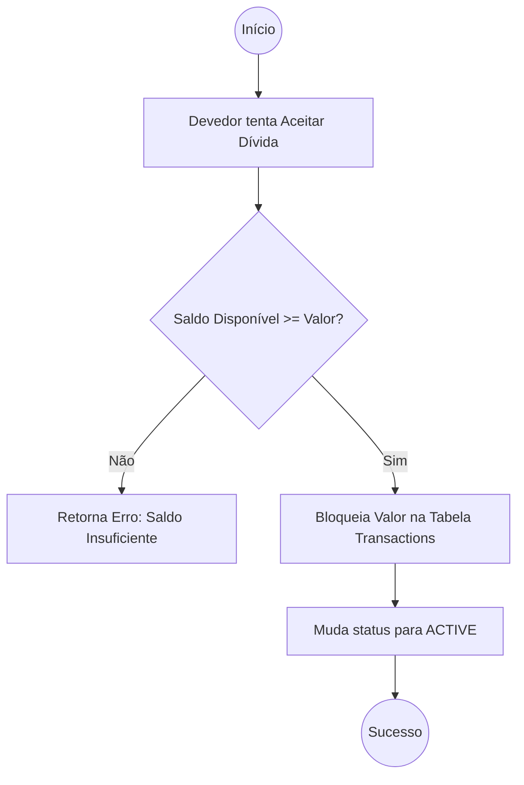

# 🧠 Regras de Negócio e Casos de Uso: "O Sindicato"

## 1. Glossário de Termos

* **Pikas ($):** A unidade de medida de poder e reputação do grupo.
* **Escrow (Caução):** O estado onde as Pikas de um usuário ficam bloqueadas pelo sistema até que um acordo seja cumprido.
* **Credor:** Aquele que registra a dívida (quem tem algo a receber).
* **Devedor:** Aquele que aceita a dívida (quem tem algo a pagar/fazer).
* **Peso do Voto:** O poder de decisão de um usuário, equivalente ao seu saldo atual de Pikas.

---

## 2. Regras de Negócio (Business Rules - BR)

### BR01 - Gênese de Saldo

Ao entrar em um grupo pela primeira vez, o usuário recebe um **Saldo Inicial de 100 Pikas**. Este valor é fixo e não pode ser alterado no MVP.

### BR02 - Isolamento de Grupos (Multi-tenancy)

O saldo de Pikas é local ao grupo. Ter 500 Pikas no "Grupo A" não dá ao usuário nenhum poder ou saldo no "Grupo B".

### BR03 - Validação de Escrow

Um devedor só pode **Aceitar** uma dívida se o seu **Saldo Disponível** for maior ou igual ao valor da dívida.

* *Saldo Disponível = Saldo Total - Saldo Bloqueado.*

### BR04 - Imutabilidade da Dívida

Uma vez que uma dívida foi **Aceita**, seu valor e descrição não podem ser editados. Se houver erro, o credor deve cancelar (se permitido) ou resolver a dívida e criar uma nova.

### BR05 - Cálculo de Poder de Voto

O peso do voto de um usuário é capturado no momento em que o voto é computado.

* **Fórmula:** .
* As Pikas bloqueadas em Escrow **continuam contando** para o peso do voto (pois ainda pertencem ao usuário, estão apenas em garantia).

---

## 3. Casos de Uso (Use Cases - UC)

### UC01: Registro de Dívida

**Ator:** Credor.

1. O Credor seleciona um membro do grupo.
2. O Credor informa o valor em Pikas e a descrição (ex: "Ficou de trazer a coca-cola").
3. O sistema cria a dívida com o status `PENDING_ACCEPTANCE`.
4. O Devedor é notificado.

### UC02: Aceite e Bloqueio (O "Coração" do Sistema)

**Ator:** Devedor.

1. O Devedor visualiza a dívida pendente.
2. O Devedor clica em "Aceitar".
3. **Sistema:** Verifica se o devedor tem saldo (BR03).
4. **Sistema:** Altera o status da dívida para `ACTIVE_ESCROW`.
5. **Sistema:** Bloqueia o valor das Pikas na carteira do devedor (elas saem do "Saldo Disponível").

### UC03: Resolução de Dívida (Pagamento)

**Ator:** Credor.

1. O Credor confirma que o devedor cumpriu o acordo (ex: A coca-cola chegou).
2. O Credor marca a dívida como "Paga/Resolvida".
3. **Sistema:** Altera o status para `SETTLED`.
4. **Sistema:** Desbloqueia as Pikas do devedor. Elas retornam ao seu "Saldo Disponível".

* *Nota:* Neste MVP, as Pikas não mudam de dono, elas são apenas um "penhor" da moral do devedor.

### UC04: Votação em Enquete

**Ator:** Qualquer membro do grupo.

1. Um usuário cria uma enquete (ex: "Onde será o churrasco?").
2. Os membros votam nas opções.
3. **Sistema:** O voto de João (que tem 100 Pikas) soma 100 pontos na opção A.
4. **Sistema:** O voto de Maria (que tem 250 Pikas) soma 250 pontos na opção B.
5. O resultado parcial mostra a opção vencedora baseada no peso das Pikas.

---

## 4. Estados da Dívida (Lifecycle)

| Status | Descrição | Bloqueia Saldo? |
| --- | --- | --- |
| `Pending` | Aguardando o devedor aceitar. | Não |
| `Active` | Dívida aceita, pikas bloqueadas em garantia. | **Sim** |
| `Settled` | Credor confirmou o pagamento, pikas devolvidas. | Não |
| `Cancelled` | Dívida cancelada antes do aceite ou pelo credor. | Não |

---

## 5. Matriz de Mensagens de Erro (Para o Front-end)

| Código de Erro | Mensagem para o Usuário | Causa |
| --- | --- | --- |
| `ERR_INSUFFICIENT_PIKAS` | "Você não tem Pikas suficientes para garantir este acordo." | Tentativa de aceite sem saldo. |
| `ERR_SELF_DEBT` | "Você não pode cobrar de você mesmo (ainda)." | Tentativa de criar dívida contra si próprio. |
| `ERR_NOT_CREDITOR` | "Apenas o credor pode confirmar este pagamento." | Usuário comum tentando baixar dívida alheia. |

---

## Diagramas

### 1. Fluxo Geral do Sistema (User Journey)

Este diagrama mostra desde a entrada do usuário até o uso das Pikas.

---

### 2. O Ciclo de Vida do Escrow (A "Dívida")

Este é o ponto mais crítico para os desenvolvedores de Backend e Frontend entenderem.

---

### 3. Lógica de Validação de Saldo (Backend)

Como o código deve se comportar quando alguém tenta aceitar um acordo.

